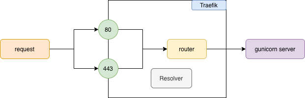

## Environment variables

All the environment variables will be hosted in just one place. To do so, some changes were nedded in order to detect the environments in all the places(docker-compose, docker, code).

 

## HTTPS

This implementation support HTTPS by Traefik. The following diagram explain how this work.

Where basically we created two **entrypoints** that are listening in the port 80 and 443. Also when traefic recieve the request from 443, it will ask to the **resolver** that handle the certificate with [letsencrypt](https://letsencrypt.org/es/) and check if the domain has https. Finally if everything goes fine, it will redirect the request to the proper server that is linked to the router(in this case, gunicorn).

 

## Zero Downtime

To do :)