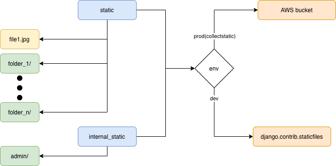
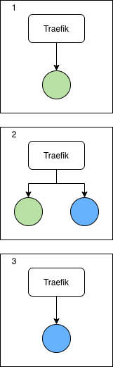

## Environment variables

All the environment variables will be hosted in just one place. To do so, some changes were nedded in order to detect the environments in all the places(docker-compose, docker, code).


<br>

## Media files

We use the storages package to handle the media files


Also the MEDIA_URL has to has a prefix in order to work properly in dev and prod

## Static files

We use the storages package to handle the static files



### Dev

We use the django.contrib.staticfiles server that Django provide to serve all the static files

### Prod

We use the storeges package to send all the static file into the S3 bucket through collecstatic

Also the STATIC_URL has to has a prefix in order to work properly in dev and prod

## HTTPS

This implementation support HTTPS by Traefik. The following diagram explain how this work.


Where basically we created two **entrypoints** that are listening in the port 80 and 443. Also when traefic recieve the request from 443, it will ask to the **resolver** that handle the certificate with [letsencrypt](https://letsencrypt.org/es/) and check if the domain has https. Finally if everything goes fine, it will redirect the request to the proper server that is linked to the router(in this case, gunicorn).

<br>

## Zero Downtime

To keep the server up and running. We used the color(green/blue) system. Were basicaly we run a new server with the new code(blue), then we start routing the requests to that server, and finally, we turn of the old server that was running(green)



```bash
#!/bin/bash

# Check if docker network is present (if not, this deployment is being done the first time)
DOCKER_NETWORK_ID=$(docker network inspect main -f '{{ .Id }}')
if [[ "${DOCKER_NETWORK_ID}" == "" ]]; then 
    docker network create main;
    docker-compose -f docker-compose-prod.yml up --force-recreate -d traefik;
    docker-compose -f docker-compose-prod.yml up -d db
    touch ./.colors;
    echo -e "export DEPLOYED_COLOR=blue" > .colors;
    echo -e "export IDLE_COLOR=green\n" >> .colors;
fi

# Get the latest colors config
source ./.colors
source ./.env

# Build and bring up new containers
# git pull origin main
# docker-compose -f docker-compose-prod.yml build --pull api
# docker-compose -f docker-compose-prod.yml up -d db
DEPLOYED_COLOR=$IDLE_COLOR docker-compose -f docker-compose-prod.yml -p $IDLE_COLOR up --scale api=1 --force-recreate -d api

# Bring down old containers once new ones are working
while [[ $(curl -s --location --request GET ''$COLOR_URL'' | tr -d \") != $IDLE_COLOR ]]; do :; done
docker-compose -p $DEPLOYED_COLOR -f docker-compose-prod.yml down

# Update the .colors config
echo -e "export DEPLOYED_COLOR="${IDLE_COLOR} > .colors
echo -e "export IDLE_COLOR="${DEPLOYED_COLOR} >> .colors

# Prune unused images/layers (from old deployment)
docker image prune -f
```
